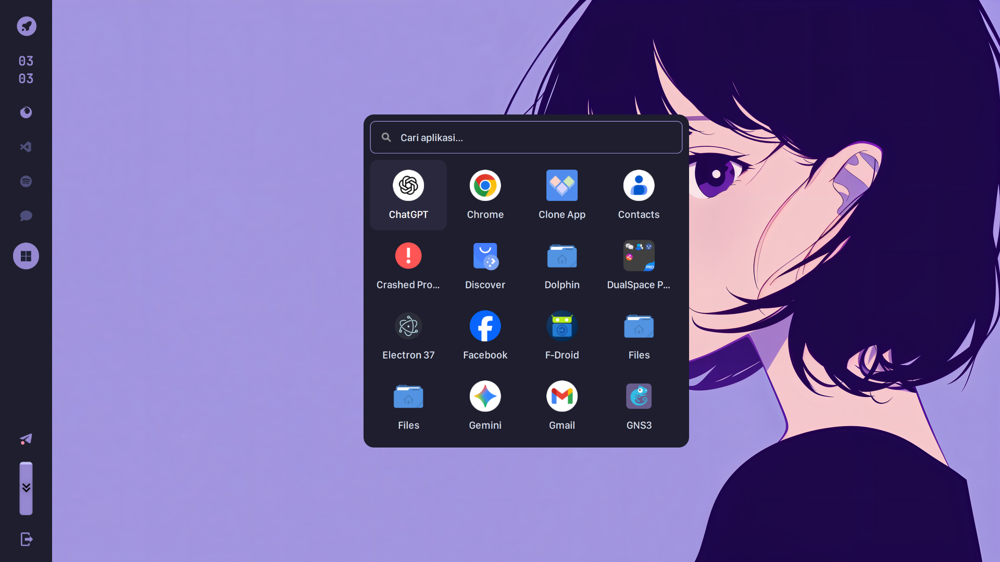
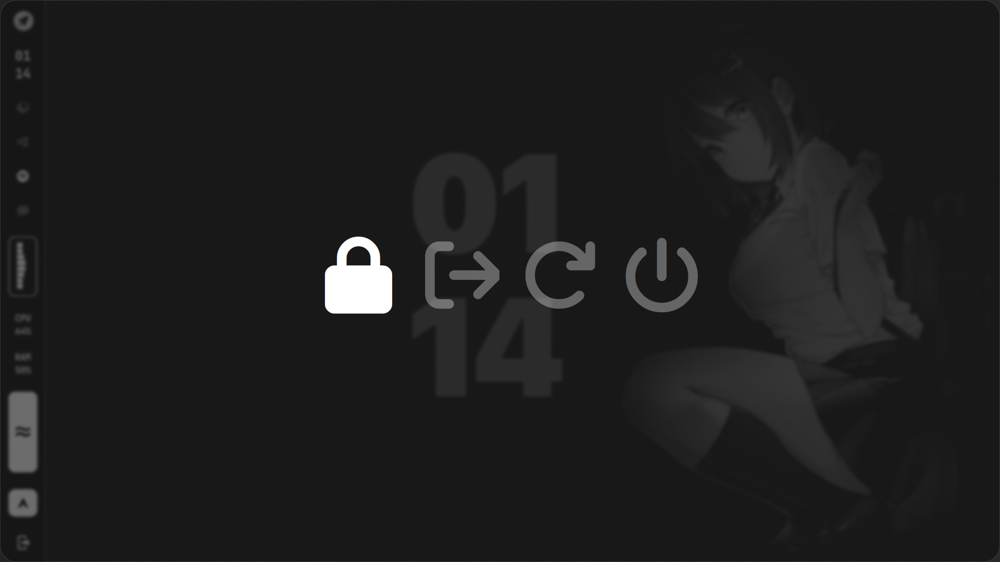

cat > ~/dotfiles/README.md << 'EOF'
# 🍙 My Dotfiles


> Screenshot setup desktop saya (Hyprland + Waybar)

Koleksi konfigurasi (dotfiles) untuk setup Linux saya menggunakan **Hyprland** dan **Waybar**.

---

## 🖼️ Gallery

| Desktop | App Launcher |
|:---:|:---:|
|  |  |
| *Clean State* | *App Launcher* |

---

## 🛠️ Details

- **OS**: Linux
- **WM**: [Hyprland](https://github.com/hyprwm/Hyprland)
- **Bar**: [Waybar](https://github.com/Alexays/Waybar)
- **Terminal**: Kitty
- **Shell**: Bash
- **Font**: JetBrains Mono Nerd Font
- **Launcher**: Rofi

---

## 📂 Structure
dotfiles/
├── hypr/
├── waybar/
├── install.sh
└── README.md


- **`hypr/`** → Konfigurasi utama Hyprland
- **`waybar/`** → Konfigurasi Waybar + styling + scripts
- **`install.sh`** → Script otomatis untuk setup & symlink config

---

## 🚀 Installation

### 1️⃣ Clone Repository

```bash
git clone https://github.com/jihan431/dotfiles.git ~/dotfiles
cd ~/dotfiles
2️⃣ Jalankan Install Script
chmod +x install.sh
./install.sh
```
🔤 Font Requirement

JetBrains Mono Nerd Font

Nerd Fonts (untuk icon Waybar & Rofi)
https://www.nerdfonts.com/

⌨️ Keybinds
Key	Action
Super + Q	Close App
Super + Enter Open Terminal
Super + E	File Manager
Super + Space	App Launcher
