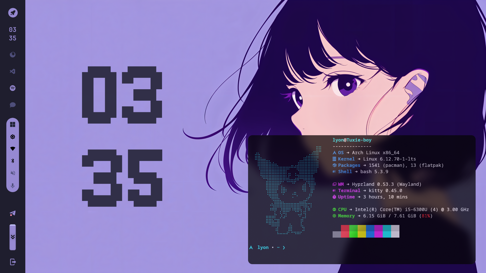
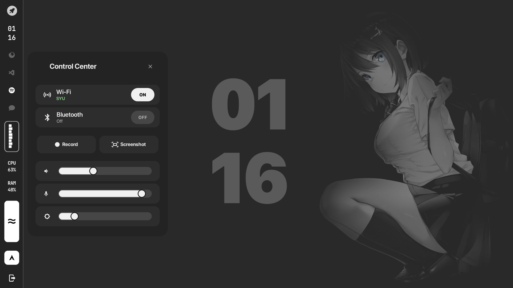

# 🍙 My Dotfiles



> A minimalist, aesthetic, and functional desktop environment.

A collection of configuration files (dotfiles) for my **Arch Linux** setup using **Hyprland**, **Waybar**, and **Eww**, consistent with the **Catppuccin Mocha** color scheme.

---

## 🖼️ Gallery

<div align="center">
  
  
  <br/>
  
  
</div>

---

## 🛠️ Details

| Component | Choice | Description |
|-----------|--------|-------------|
| **OS** | Arch Linux | Bleeding edge |
| **WM** | [Hyprland](https://github.com/hyprwm/Hyprland) | Dynamic tiling wayland compositor |
| **Bar** | [Waybar](https://github.com/Alexays/Waybar) | Vertical, icon-only bar |
| **Lock** | [Hyprlock](https://wiki.hyprland.org/Hypr-Ecosystem/hyprlock/) | Aesthetic lock screen (SF Compact font) |
| **Widgets** | [Eww](https://github.com/elkowar/eww) | Clock & Premium Control Center |
| **Terminal**| Kitty | GPU accelerated terminal |
| **Launcher**| Rofi (Wayland) | Application launcher & menus |
| **Shell** | Bash | With Starship prompt |
| **Theme** | Catppuccin Mocha | Mauve accent |
| **Font** | SF Compact Display | Primary UI font |

---

## 🚀 Installation

### 1. Clone the repository
```bash
git clone https://github.com/jihan431/dotfiles.git
cd dotfiles
```

### 2. Run the installer
The `install.sh` script handles symlinking and dependency installation.

```bash
chmod +x install.sh
./install.sh
```

> **Note**: The script backs up existing configurations to `.bak` files.

---

## ⌨️ Keybindings

| Keybind | Action |
|---------|--------|
| `SUPER + Q` | Close Window |
| `SUPER + RETURN` | Open Terminal |
| `SUPER + SPACE` | Open App Launcher |
| `SUPER + E` | Open File Manager |
| `SUPER + L` | **Open Power Menu** |
| `SUPER + V` | Toggle Floating |
| `SUPER + F` | Fullscreen |

---

## ✨ Features

### 🎛️ Control Center
A premium, glassmorphism-inspired control panel for system management:
- **Connectivity**: Managed Wi-Fi (with inline password) and Bluetooth.
- **System Controls**: Audio, Microphone, and Brightness sliders with mute/toggle support.
- **Capture Hub**: 
    - **Screen Recording**: Toggle with active status feedback (using `wf-recorder`).
    - **Aesthetic Screenshots**: Select area, save to `~/Pictures/Screenshot` and copy to clipboard.

---

## 📂 Structure

```text
dotfiles/
├── eww/                  # Custom Widgets (Clock & Control Center)
│   ├── scripts/          # Backend for WiFi, BT, Audio, and Capture
├── fonts/                # Custom font collection
├── hypr/                 # Hyprland & Hyprlock config
├── waybar/               # Waybar config & scripts
├── rofi/                 # App Launcher theme
├── gtk-3.0/              # Gtk styling
├── gtk-4.0/              # Gtk styling
├── install.sh            # Setup script
└── README.md             # Documentation
```